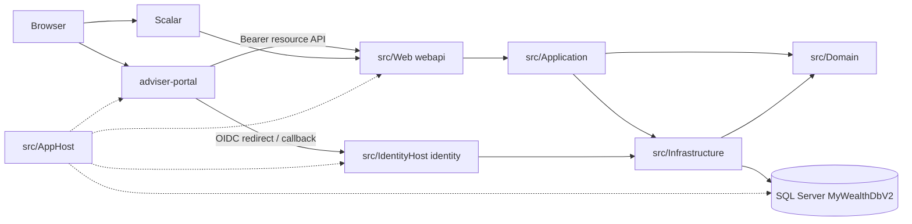

# Architecture

This document owns **hosts, layers, ports, and cross-cutting behaviour**. Scope and phasing live in [function-plan.md](function-plan.md). Aggregates and invariants live in [domain-model.md](domain-model.md). Tables live in [database-design.md](database-design.md). HTTP conventions and the resource catalog live in [api-design.md](api-design.md). Session protocol detail lives in [ADR 0014](adr/0014-openiddict-authorization-code-pkce.md); this file only places the host.

**Product:** MyWealthV2.

Same rule as the function plan: if a later phase will use it and today’s design would have to change, ship the final infrastructure now. If later use or shape is not decided, wait.

Phase 1 closes the platform base: tenants, session, four roles, people, currency catalog, Adviser Portal shell. The ledger is a Phase-2 domain. The first accepted ledger slice is Instruments (`0010_instruments.sql`, `/instruments`, mocked `IMarketData` / `IFxRate`), landed `9ea2f2a`. The second accepted slice is Accounts (`0012_accounts.sql`, `/accounts`) — not landed until that slice ships. Other ledger tables wait for their specs.

---

## 1. Style

Clean Architecture + CQRS (MediatR), hosted by .NET Aspire.



Rules that stay true:

- `Domain` has no project references. Entities are hand-written, not scaffolded from the database.
- `Application` depends only on `Domain` and abstractions it owns.
- `Infrastructure` implements those abstractions and maps to existing tables with Fluent API.
- `Web` (`webapi`) is the resource-API composition root. Endpoints dispatch MediatR only.
- `IdentityHost` (`identity`) is the authorization-server composition root: OpenIddict + hosted login.
- New write / read use cases are scaffolded with `dotnet new ca-usecase`.

The frontend is an independent React application (React + Redux Toolkit + TypeScript + Vite + Tailwind). Portals **do not issue tokens**. They redirect to `identity`, receive access and refresh tokens, and call `webapi` with Bearer.

Portals:

- **Adviser Portal** — only frontend and only public OIDC client in Phase 1
- Customer Portal — later second client on the same authorization server; not registered in Phase 1
- Back Office — optional; SystemAdmin uses Scalar / API in Phase 1

Aspire resource names must not be generic (`Frontend`, `Web`). Phase 1 hosts `identity`, `webapi`, and `adviser-portal`. Reserved names: `customer-portal`, `back-office`. Phase 1 does **not** split a separate identity **database**.

One AppHost orchestrates every resource. Separate projects are separate processes. Each ASP.NET project has its own Kestrel and port. Aspire does not merge two projects onto one Kestrel.

---

## 2. Solution map

| Project | Path | Responsibility |
| --- | --- | --- |
| AppHost | `src/AppHost` | Aspire graph: `dbserver`, `MyWealthDbV2`, `identity`, `webapi`, `adviser-portal` |
| IdentityHost | `src/IdentityHost` | Authorization-server composition root; OpenIddict; hosted login |
| Web | `src/Web` | Resource-API composition root; Minimal API; OpenAPI / Scalar; CORS; Bearer validation |
| Application | `src/Application` | Commands / queries, validation, pipeline, DTOs, named-policy map, port interfaces |
| Domain | `src/Domain` | Entities, value objects (including `Money`), events, enumerations. No session-protocol types |
| Infrastructure | `src/Infrastructure` | EF mapping, Identity user store, OpenIddict EF stores, interceptors, schema applicator, port adapters |
| Shared | `src/Shared` | Aspire resource-name constants |
| ServiceDefaults | `src/ServiceDefaults` | Health, OpenTelemetry, service discovery |
| AdviserPortal | Independent frontend | Only frontend in Phase 1; OIDC client id `adviser-portal` |
| Tests | `tests/*` | Domain unit, application unit, infrastructure integration, functional |

`ApplicationDbContext` includes the Identity **user** store and the OpenIddict EF stores. **Both hosts share the same mappings and the same database.** Do not use `IdentityRole` / `AspNetRoles`.

---

## 3. Two request paths

Two processes, two surfaces. Do not add a custom `POST /auth/login` that issues tokens.

### 3.1 Authorization server (OpenIddict, process `identity`)

Hosted in `src/IdentityHost` (ADR 0014). Aspire resource name: `identity`.

| Surface | Choice |
| --- | --- |
| Protocol | OpenIddict **defaults, do not remap**: `/.well-known/openid-configuration`, `/.well-known/jwks`, `/connect/authorize`, `/connect/token`, `/connect/revocation`, `/connect/logout` (plus default `/connect/userinfo`). Callers follow discovery; do not hard-code |
| Hosted login | Password page on `identity`: email + password + tenantCode (SystemAdmin omits tenantCode) |
| Client | One public client in Phase 1: `adviser-portal`. Authorization code + PKCE + refresh. No password grant |
| Access | Short-lived JWT. **Asymmetric** signing. Public keys on JWKS |
| Refresh | OpenIddict token store. Revoked on logout, password change, and disable. No custom `RefreshTokens` table |
| Scopes | `openid`, `profile`, `offline_access`, `api`. Role and tenant are JWT claims, not scopes. Permissions are not expanded into the token |

The login gate on the authorization server reads domain invariants: tenant enabled, `UserStatus = Active`, valid Identity link, then the client × role allow-list. `adviser-portal` does not issue a code to Customer. Adviser-management resource policies stay 403.

The portal only: redirect → callback → store tokens → call the resource API. It does not own a password form that issues tokens.

### 3.2 Resource API (`webapi`)

Minimal API → MediatR. Pipeline order:

Logging → UnhandledException → Authorization → Validation → Performance → Handler

Save interceptors:

- `AuditableEntityInterceptor`
- `DispatchDomainEventsInterceptor`

Writes to Tenant / User check `RowVersion`. Conflict maps to HTTP 409.

Bearer tokens are accepted only from `identity` (discovery / JWKS). `/users/me` lives on `webapi`; it is not a token endpoint. Login-page cookies stay on the `identity` origin. `webapi` returns 401 on auth failure and never redirects to the login page.

Application authorization (ADR 0013): named policies on endpoints; `RolePermissions` mapped in code; assignment scope (this tenant / own customers) enforced in the handler. Do not register empty ledger policy names in Phase 1.

### 3.3 How OpenIddict is hosted

**Phase 1 hosts OpenIddict as its own Aspire resource `identity`.** Two Kestrel processes, one SQL database (`MyWealthDbV2`), one Infrastructure mapping set. Not a second identity database.

```text
AppHost
  dbserver (SQL container)
    └── MyWealthDbV2          connection string → identity and webapi
  identity                    src/IdentityHost
    ├── OpenIddict            default /connect/* + discovery + JWKS
    └── hosted login          email + password + tenantCode
  webapi                      src/Web
    └── resource API          MediatR + Bearer
  adviser-portal              public OIDC client (browser)
```

Aspire does three things for the session stack:

1. Injects the `MyWealthDbV2` connection string into **both** hosts.
2. Publishes service-discovery URLs for `identity` (issuer), `webapi`, and `adviser-portal`, so redirect URIs, CORS, and OIDC authority match.
3. In Development, adds the portal callback origin and the Scalar origin to CORS / client redirects.

The schema applicator runs **once** (default: `webapi` startup, or an explicit apply step). `identity` must not run a second applicator concurrently.

### 3.4 Phase 1 configuration (locked here; package versions and lifetimes are not)

| Item | Choice |
| --- | --- |
| Packages | OpenIddict ASP.NET Core + official EF store (follow the package tables; do not invent `RefreshTokens`) |
| Issuer | Base URL of `identity` (Aspire service discovery in Development; a stable HTTPS name in production) |
| Keys | Asymmetric signing. Development certificate is allowed. Production certificate; private key is not committed. APIs validate via JWKS. `UseLocalServer()` is not the default validation path |
| Client | One `OpenIddictApplications` row: `ClientId = adviser-portal`, public + PKCE, password grant off |
| Redirect | `{portalOrigin}/callback`. Post-logout `{portalOrigin}/`. Both must be upserted on the OpenIddict client (local Vite origin + Aspire dashboard alias) |
| Scopes | `openid`, `profile`, `offline_access`, `api` |
| Tokens | Short-lived JWT access. Refresh in `OpenIddictTokens`. Absolute / sliding lifetimes belong in the identity-auth Feature Spec |
| Login page | Razor Pages at `/login` on `identity`. Validates with `UserManager`, then returns to the authorization-code flow |
| Claims | `sub` = user PublicId, `email`, `role`, `tenant_id`, `tenant_code` (tenant claims empty for SystemAdmin) |
| Resource API | `webapi` uses JwtBearer / OpenIddict validation against the `identity` issuer and JWKS. No second symmetric key that mints tokens |
| Seed | Client row: SQL or startup seed. People and passwords still go through `UserManager` |
| Revocation | `webapi` handles domain events and writes the shared OpenIddict store through a port. Logout revokes on `identity`. A later identity-database split replaces that port only |

Access lifetime is 15 minutes. Refresh lifetime is 14 days absolute. Hosted login is Razor Pages at `/login`. See identity-auth.

---

## 4. Local runtime

```bash
dotnet run --project src/AppHost
```

| Resource | Name | Notes |
| --- | --- | --- |
| SQL Server container | `dbserver` | `RunAsContainer` |
| Database | `MyWealthDbV2` | Aspire `AddDatabase` name = SQL name = connection-string name injected into `identity` and `webapi` |
| Authorization server | `identity` | OpenIddict + hosted login |
| Web API | `webapi` | Scalar at `/scalar`; Bearer only |
| Adviser Portal | `adviser-portal` | Vite frontend. First slice: OIDC callback + session probe. Pages come later. |

**Database lifecycle (ADR 0008)**

- Source of truth: versioned SQL under `database/schema/` plus `SchemaVersions`.
- Startup runs the schema applicator for scripts not yet recorded. The default path does **not** `EnsureDeleted`.
- Local reset is an explicit command: drop → scripts → seed.
- Reference data (currencies, sample tenant rows, optional OpenIddict client) may be SQL or startup seed.
- Identity users and passwords go through `UserManager` (hashes are not hand-written into SQL).

EF does **not** generate migrations. `IEntityTypeConfiguration` maps only.

identity-auth scripts: SchemaVersions, Identity user tables, OpenIddict tables, Tenants (no ReportingCurrency), Users, UserTokens. Currencies slice adds `0008_currencies.sql` and `0009_tenants_reporting_currency.sql`. Instruments slice adds `0010_instruments.sql`. Phase 1 scripts do not include Accounts, Holdings, Transactions, a custom RefreshTokens table, or AspNetRoles.

---

## 5. Cross-cutting

| Concern | Choice | Where |
| --- | --- | --- |
| Authentication | OpenIddict authorization code + PKCE; hosted login; short JWT + revocable refresh | `identity` issues; `webapi` validates; Infrastructure is shared |
| Login key | Non-SystemAdmin must send tenantCode. Email unique inside a tenant. SystemAdmin email unique globally | Hosted login + Domain lookup |
| Authorization | Named policies + code Role → permission; scope in the handler | `webapi` endpoints + Application (ADR 0013) |
| Tenancy | Shared database + row `TenantId` + **database FK** + application dual check + EF filter + isolation tests | Everywhere. No SQL RLS, database-per-tenant, schema-per-tenant, or subdomain in Phase 1 |
| Currency | `Currencies` catalog + in-memory `ICurrencyCatalog` | Domain rules + Infrastructure |
| Instruments / market / FX | Phase 2 instruments slice. Tenant table + mocked ports | [features/instruments.md](features/instruments.md) |
| Keys | Internal `int` identity; HTTP uses `PublicId` UUID | Domain / database / API |
| Money | `Money` value object in Domain; no balance column in Phase 1 | Domain |
| Validation | FluentValidation + database constraints + entity invariants | Use case + SQL + Domain |
| Mapping | AutoMapper (may keep) | Application |
| Errors | Rule / validation 400; unauthenticated or cannot complete login 401; policy 403; invisible / cross-tenant 404; concurrency 409 | `webapi` |
| Observability | Aspire / OpenTelemetry defaults | ServiceDefaults |
| CORS | Loose in Development; tighten in production without blocking Phase 1 | `webapi` (and `identity` as needed for the login origin) |
| Ports | See §6 | Defined in Application, implemented in Infrastructure |

Tenant resolution: login requires tenantCode except for SystemAdmin. The JWT carries tenant PublicId and `tenantCode` (empty for SystemAdmin). Request handling must **not** trust only an easy-to-miss global filter. Repositories / handlers tighten to the current tenant again (dual check). Isolation tests are a CI gate.

API paths and JSON use PublicId only. Internal code still uses `int`.

Password change, disable, and logout revoke that subject’s OpenIddict tokens. The User aggregate does not hold tokens. After a tenant is disabled, that Code must not complete login and existing refresh must fail. Disabling a tenant does **not** bulk-update `User.Status`. Person status is independent; login checks both.

---

## 6. Ports

| Port | Ships | Notes |
| --- | --- | --- |
| `IApplicationDbContext` | Phase 1 | EF entry |
| `ICurrencyCatalog` | Phase 1 | In-memory catalog. Hot path does not JOIN `Currencies` |
| `IEmailSender` | Phase 1, no-op | Invite / reset seam. No send use case this phase |
| `IIdentityService` (or equivalent) | Phase 1 | Create / verify / change-password for Identity users. OpenIddict protocol stays out of Domain |
| Token-revocation port | Phase 1 | `webapi` writes the shared OpenIddict store today. Replace the adapter if the identity database splits later |
| `IMarketData` | Phase 2 instruments | `TryGetPrice(instrumentId, asOf?) → Money?`. Mock. Missing → empty, not 0 |
| `IFxRate` | Phase 2 instruments | `GetRate(from, to, asOf?)`. Same currency = 1. Missing cross pair fails |

Do not add a port whose surface is still open. Do add a port (or value object) when later use is certain and omitting it would force a Phase-1 redesign (`Money`, `ICurrencyCatalog`, no-op `IEmailSender`).

---

## 7. Tests

| Project | Purpose |
| --- | --- |
| `Domain.UnitTests` | Phase 1: User / Tenant invariants, currency Code, `Money`. Phase 2: `Instrument` (landed). `Account` after the accounts spec is accepted |
| `Application.UnitTests` | Pure application helpers, policy map |
| `Infrastructure.IntegrationTests` | Real database: scripts + EF mapping + FK + applicator |
| `Application.FunctionalTests` | HTTP + TestAppHost (**starts `identity` and `webapi`**). Cross-tenant read / write must fail. Login gate is on `identity` (disabled / Pending / wrong tenant → no session) |

Each new Feature Spec says which test project gains coverage and which isolation assertions it adds. From Tenants onward, every business slice has isolation tests.

A Customer completing the authorization-server flow must have a test. Adviser-management routes must return 403 for a Customer token.

---

## 8. Frontend constraints (detail lives in portal docs)

- Client id and Aspire resource name: `adviser-portal`.
- Login: redirect to hosted login on `identity`. The portal does not own a token-issuing password form.
- Session: access + refresh. Refresh hits the token endpoint on `identity`. Logout is end session (`/connect/logout` action on IdentityHost, identity-auth R21) plus `POST /connect/revocation`. The portal redeems an authorization code once.
- Menu filtered by role. A Customer must not enter this client.
- Phase 1 pages: shell, Profile, Customers, Advisers. Default home is Customers. No Accounts, Instruments, Transactions, or Dashboard.
- People resource APIs use the `/users` namespace (`/users/me`, `/users/advisers`, `/users/customers`, `/users/tenant-admins`). Tenants and currencies stay at the root.

---

## 9. Where Phase 2 attaches

The session stack, four roles, User / Tenant invariants, and `identity` as the authorization server **do not change**. Phase 2 adds ledger policy names, ledger aggregates, and `IMarketData` / `IFxRate`.

SystemAdmin receives Phase-2 ledger policies and calls `webapi` from Scalar (later Back Office). List / create take a tenant PublicId. Adviser Portal does not grow SystemAdmin ledger screens. Phase 1 people routes stay as they are.

Each Phase-2 slice adds Development / TestAppHost `TestSeed` rows. Not schema scripts. Not Production.

The ledger is one domain with internal slices. Instruments storage is locked. Account / cash / holdings / posting storage waits for the accepted spec. Phase 1 does not create Journal or CashLedger tables. Tendencies: [domain-model.md](domain-model.md) §8 and [function-plan.md](function-plan.md) §5.

If the identity **database** splits later, replace the revocation / login-principal port implementation. Do not change the protocol or the Aspire resource name `identity`.

---

## 10. ADR index (architecture view)

Locked conclusions follow function-plan §0 and these ADRs. This folder currently holds English ADR 0014. Treat 0001–0013 as the locked bullets in the function plan until they are ported.

| ADR | Constraint on this document |
| --- | --- |
| 0001 | Aspire + Clean Architecture |
| 0002 | SQL Server hosted by Aspire |
| 0003 | React / Redux / TypeScript / Vite / Tailwind; portal is its own resource |
| 0004 / 0009 | Money = amount + currency; platform `Currencies` + `ICurrencyCatalog` |
| 0005 | Shared database + TenantId; dual check + isolation tests |
| 0006 | **Superseded as issuer and host by 0014.** No custom `/auth/login`. OpenIddict is not inside `webapi`. ASP.NET Identity still stores password hashes |
| 0007 | Internal int PK; external PublicId |
| 0008 | Versioned SQL is schema truth; applicator; `EnsureDeleted` is not the default boot path |
| 0010 | Instrument catalog — Phase 2 |
| 0011 | Ledger tendencies — Phase 2 |
| 0012 | `UserStatus` + `UserTokens` / email-port seams; invitation not built |
| 0013 | Four roles, one table per layer, named policies + code map |
| 0014 | OpenIddict in Aspire `identity`; authorization code + PKCE; hosted login; one client; same `MyWealthDbV2` |

---

## 11. Changelog

| Date | Change |
| --- | --- |
| 2026-09-11 | First English draft. Aligns with locked Phase-1 host: `identity` + `webapi` + `adviser-portal`, shared `MyWealthDbV2`, OpenIddict authorization code + PKCE, dual-check tenancy, Phase-1 ports only. |
| 2026-09-11 | Protocol paths locked to OpenIddict defaults (including `/connect/revocation` and `/connect/logout`); do not remap. |
| 2026-09-14 | End-session passthrough requires an IdentityHost SignOut action (identity-auth R21). Portal revokes refresh then redirects; authorization codes redeem once. |
| 2026-09-11 | Point HTTP conventions at api-design.md. People APIs use the `/users` namespace. |
| 2026-09-12 | identity-auth: Razor `/login`; JWT claim names; 15 min / 14 day absolute tokens. Currencies not in the identity-auth script set. |
| 2026-09-20 | Instruments ports + `/instruments`. SystemAdmin ledger policies on Scalar. |
| 2026-09-21 | Instruments landed `9ea2f2a`. Accounts Feature Spec opened as `draft`. |
