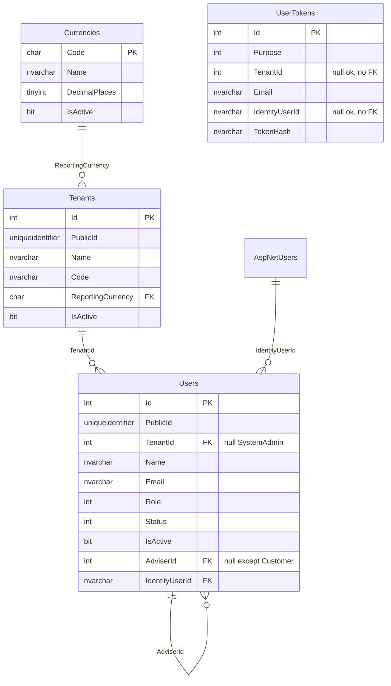

# Database design

This document owns **accepted tables, keys, indexes, constraints, and script order**. Scripts themselves live in `database/schema/`. Aggregates and invariants live in [domain-model.md](domain-model.md). Scope lives in [function-plan.md](function-plan.md). Field rules for Instruments live in [features/instruments.md](features/instruments.md). Boolean catalog flags are `IsActive` (naming amendment 2026-09-21, script `0011`).

**Product:** MyWealthV2.

Phase 1 scripts create the platform base. Phase 2 accepted so far: `Instruments` (`0010_instruments.sql`). Do **not** create Accounts, Holdings, Transactions, Journal, or CashLedger until those specs are accepted. There is no custom `RefreshTokens` table; refresh lives in the OpenIddict token store. Demo instruments are `TestSeed`, not the schema script.

---

## 1. Platform

| Item | Choice |
| --- | --- |
| Engine | SQL Server (Aspire container `dbserver`) |
| Database | `MyWealthDbV2` |
| Access | EF Core 10 `UseSqlServer` |
| Schema truth | Versioned SQL under `database/schema/NNNN_description.sql` |
| Version ledger | `SchemaVersions(Id, ScriptName, AppliedAt)` |
| EF | Fluent mapping only. No EF migrations. Domain is not scaffolded from the database. |
| Naming | Pascal-case tables aligned with CLR. OpenIddict and Identity keep package names. |
| Context | `ApplicationDbContext` includes Identity **user** store + OpenIddict EF stores. Shared by `identity` and `webapi`. Do not use `IdentityRole`. |

Identity password seed goes through `UserManager`. OpenIddict clients may be inserted in SQL or in a startup seed.

---

## 2. Lifecycle

- Startup: schema applicator runs scripts not yet in `SchemaVersions`. The default path does **not** drop the database.
- Local reset: explicit drop → all scripts → seed (`UserManager` for passwords; OpenIddict clients in SQL or startup).
- CI: empty database applies the full script set; mapping and FK tests run against that database.

---

## 3. Conventions

| Topic | Convention |
| --- | --- |
| Primary key | `Id int` identity, clustered. Internal only. |
| Public id | `PublicId uniqueidentifier NOT NULL` unique on resources that appear in HTTP. Default `NEWSEQUENTIALID()` or an app-generated UUID. Not the PK. |
| Tables with PublicId | `Tenants`, `Users`, `Instruments` |
| Tables without PublicId | `Currencies` (natural key `Code`), `SchemaVersions`, `UserTokens` (caller holds the raw token; store stores the hash), Identity string keys, OpenIddict package keys |
| Tenancy | Business tables carry `TenantId`. Null only on `Users` for SystemAdmin. FK `Users.TenantId` → `Tenants`. |
| Audit | `Created datetimeoffset`, `CreatedBy nvarchar(450)`, `LastModified datetimeoffset`, `LastModifiedBy nvarchar(450)` on `Tenants`, `Users`, and `Instruments`. `CreatedBy` stores the actor’s Identity id or a system name. |
| Concurrency | `RowVersion rowversion` on `Tenants`, `Users`, and `Instruments`. HTTP 409 on conflict. |
| Soft delete | Not used. |
| Status + IsActive | Rows that have a **status machine** store both: `Status` (source of truth) and `IsActive` (filter bit). `IsActive` is **derived**, never written by HTTP. Preferred SQL: persisted computed column from `Status`. Catalog rows (Tenant, Currency, Instrument) have `IsActive` only — no status machine. Never `IsEnabled`. |
| Money | No money columns in Phase 1. When the ledger exists: `decimal(18,4)` + `char(3)` FK to `Currencies`. |
| Strings | `nvarchar` + explicit max length. Email / Name / Code uniqueness is case-insensitive (`SQL_Latin1_General_CP1_CI_AS` or an equivalent CI collation). |
| Enums | `int` on `Users.Role`, `Users.Status`, `UserTokens.Purpose`, later `Accounts.Status`. |
| Delete | `RESTRICT` (no cascade) on Phase-1 business FKs. |

---

## 4. Phase 1 table list

```text
SchemaVersions
Currencies
AspNetUsers / AspNetUserClaims / AspNetUserLogins / AspNetUserTokens
  (Identity user store only — no AspNetRoles / AspNetUserRoles / AspNetRoleClaims)
OpenIddictApplications / OpenIddictAuthorizations / OpenIddictScopes / OpenIddictTokens
  (plus any extra table the chosen OpenIddict EF package maps, e.g. Sessions — follow the package)
Tenants
Users
UserTokens
Instruments                  -- Phase 2 instruments slice (`0010`)
```

Not in Phase 1:

- Custom `RefreshTokens`
- `AspNetRoles` and related role tables
- Ledger tables
- Empty placeholder Journal / CashLedger tables

---

## 5. Relationships



`AspNetUsers.TenantId` is a projection column. It is **not** drawn as an FK.

---

## 6. Columns

### 6.1 SchemaVersions

| Column | Type | Null | Notes |
| --- | --- | --- | --- |
| Id | int identity | no | PK |
| ScriptName | nvarchar(200) | no | Unique. File name of the applied script |
| AppliedAt | datetimeoffset | no | |

### 6.2 Currencies

Platform catalog. No audit, no `RowVersion`, no `PublicId`.

| Column | Type | Null | Notes |
| --- | --- | --- | --- |
| Code | char(3) | no | PK, ISO 4217 upper case |
| Name | nvarchar(100) | no | |
| DecimalPlaces | tinyint | no | ISO minor units for display / validation (JPY = 0, NZD = 2). Not the Phase-2 money-column scale (`decimal(18,4)`) |
| IsActive | bit | no | Default 1. **Platform** flag. Not per tenant. Disable does not rewrite `Tenants.ReportingCurrency`. Renamed from `IsEnabled` in `0011`. |

Seed: NZD, AUD, USD, EUR, GBP, JPY.

No `NumericCode` column (not required by the catalog ADR).

### 6.3 Identity user store (`AspNetUsers` + siblings)

Use the ASP.NET Identity schema for a **user-only** store (`IdentityUserContext<ApplicationUser>` / equivalent). Do not create role tables.

`ApplicationUser` maps to `AspNetUsers` and adds **one** business column:

| Column | Type | Null | Notes |
| --- | --- | --- | --- |
| TenantId | int | yes | Projection. Null for SystemAdmin. **No FK** to `Tenants` |

Do **not** add on `AspNetUsers`:

- `DomainUserId` — reverse pointer. Lookup is `Users.IdentityUserId` (unique). A reverse FK would cycle with `Users.IdentityUserId → AspNetUsers`.
- `Role` — truth is `Users.Role`. Login already loads `Users` for `Status` and tenant.
- `DisplayName` — truth is `Users.Name`.
- `AdviserId` / `Status` — Domain only.

Identity’s own `Email` column stays (framework). Turn **off** `RequireUniqueEmail`. Uniqueness is on `Users`.

`AspNetUserTokens` is Identity’s authenticator / provider token table. It is **not** `UserTokens`.

### 6.4 OpenIddict stores

Library-owned. Register with `UseEntityFrameworkCore()` and keep package column names.

Default tables:

| Table | Holds |
| --- | --- |
| `OpenIddictApplications` | Clients. Phase 1 row: public client `adviser-portal` |
| `OpenIddictAuthorizations` | Grants |
| `OpenIddictScopes` | `openid`, `profile`, `offline_access`, `api` |
| `OpenIddictTokens` | Authorization codes, access tokens, **refresh tokens** |

Do not add business columns to these tables. Do not replace `OpenIddictTokens` with a custom refresh table.

Client seed: SQL insert or startup seed. Both are allowed.

### 6.5 Tenants

| Column | Type | Null | Notes |
| --- | --- | --- | --- |
| Id | int identity | no | PK |
| PublicId | uniqueidentifier | no | Unique |
| Name | nvarchar(200) | no | Unique CI |
| Code | nvarchar(50) | no | Login code, unique CI, `[a-z0-9-]{2,50}` |
| ReportingCurrency | char(3) | no | Added by the currencies slice (`0009`). FK → `Currencies.Code`. No column default after apply |
| IsActive | bit | no | Default 1. Renamed from `IsEnabled` in `0011`. |
| RowVersion | rowversion | no | |
| Created / CreatedBy / LastModified / LastModifiedBy | audit | | |

`Code` is treated as immutable after create by the Tenants slice (no update API). The column itself is ordinary.

identity-auth created `Tenants` **without** `ReportingCurrency`. Login only needs `Code` and the active flag. The currencies slice adds the catalog (`0008`) and then `Tenants.ReportingCurrency` (`0009`). `0011` renames `IsEnabled` → `IsActive` on `Currencies`, `Tenants`, and `Instruments`. Do not back-fill `0002` / `0005` / `0008` / `0010`.

### 6.6 Users

One table for all four roles. Credentials live on `AspNetUsers`.

| Column | Type | Null | Notes |
| --- | --- | --- | --- |
| Id | int identity | no | PK |
| PublicId | uniqueidentifier | no | Unique. JWT subject uses this |
| TenantId | int | yes | FK → `Tenants`. Null only for SystemAdmin |
| Name | nvarchar(200) | no | |
| Email | nvarchar(256) | no | Unique inside a tenant; SystemAdmin unique globally |
| Role | int | no | 0 SystemAdmin, 1 TenantAdmin, 2 Adviser, 3 Customer |
| Status | int | no | 0 PendingActivation, 1 Active, 2 Disabled. Source of truth |
| IsActive | bit | no | Derived. `1` iff `Status = Active`. Added by `0011` as persisted computed (preferred) or CHECK-paired bit |
| AdviserId | int | yes | Required for Customer. FK → `Users.Id` |
| IdentityUserId | nvarchar(450) | no | FK → `AspNetUsers.Id`. Unique. One-to-one |
| RowVersion | rowversion | no | |
| Created / CreatedBy / LastModified / LastModifiedBy | audit | | |

Uniqueness:

- Filtered unique `(TenantId, Email)` WHERE `TenantId IS NOT NULL`
- Unique `Email` WHERE `TenantId IS NULL` (SystemAdmin)
- Unique `IdentityUserId`
- Unique `PublicId`

CHECK (in SQL; tests cover the same):

- `Role = SystemAdmin` → `TenantId IS NULL AND AdviserId IS NULL`
- `Role IN (TenantAdmin, Adviser)` → `TenantId IS NOT NULL AND AdviserId IS NULL`
- `Role = Customer` → `TenantId IS NOT NULL AND AdviserId IS NOT NULL`

Same-tenant Adviser for a Customer is enforced in the application (CHECK cannot see the parent row’s `TenantId` cheaply without a trigger). Isolation tests cover it.

**One-way FK only:** `Users.IdentityUserId` → `AspNetUsers.Id`. No `AspNetUsers` → `Users` FK.

### 6.7 UserTokens

Reserved seam for invite / password-reset. Phase 1 **creates the table and has no write API**.

The token follows the **login principal** (`AspNetUsers.Id`), which is the usual shape for reset and matches Phase-1 create (Identity row already exists when a person is created). `IdentityUserId` is nullable so an email-first invite can be stored later without a migration that changes meaning.

| Column | Type | Null | Notes |
| --- | --- | --- | --- |
| Id | int identity | no | PK |
| Purpose | int | no | 0 Invite, 1 PasswordReset |
| TenantId | int | yes | Null for SystemAdmin reset. **No FK** |
| Email | nvarchar(256) | no | Denormalised; login key with tenant |
| IdentityUserId | nvarchar(450) | yes | Logical pointer to `AspNetUsers.Id`. **No FK** |
| TokenHash | nvarchar(128) | no | Store hash only. Unique |
| ExpiresAt | datetimeoffset | no | |
| ConsumedAt | datetimeoffset | yes | Null = unused |
| Created | datetimeoffset | no | |
| CreatedBy | nvarchar(450) | no | |

No `PublicId`, no `RowVersion`, no `LastModified`. Consume sets `ConsumedAt`.

Why no FK on `IdentityUserId` / `TenantId`: this is a seam table. A reverse or extra FK would couple token rows to Identity / tenant delete order before any write use case exists. Lookup is by hash (unique) or `(TenantId, Email)`.

---

## 7. Foreign keys and delete (Phase 1)

| Parent → child | Child column | On delete |
| --- | --- | --- |
| `Currencies` → `Tenants` | `ReportingCurrency` | RESTRICT (added in `0009`) |
| `Currencies` → `Instruments` | `QuoteCurrency` | RESTRICT (`0010`) |
| `Tenants` → `Instruments` | `TenantId` | RESTRICT |
| `Tenants` → `Users` | `TenantId` | RESTRICT |
| `Users` → `Users` | `AdviserId` | RESTRICT |
| `AspNetUsers` → `Users` | `IdentityUserId` | RESTRICT |
| OpenIddict package FKs | as shipped | as shipped |
| Identity package FKs | as shipped | as shipped |

No FK:

- `AspNetUsers.TenantId`
- `UserTokens.TenantId`
- `UserTokens.IdentityUserId`

---

## 8. Indexes (Phase 1)

Beyond PK / unique constraints already listed:

- `Tenants(Code)`, `Tenants(Name)`, `Tenants(PublicId)`, `Tenants(IsActive)`
- `Users(TenantId, Email)`, `Users(TenantId, Role)`, `Users(AdviserId)`, `Users(PublicId)`, `Users(IdentityUserId)`, `Users(Status)`, `Users(TenantId, IsActive)`
- `UserTokens(TokenHash)`, `UserTokens(TenantId, Email)`, `UserTokens(IdentityUserId)`
- OpenIddict / Identity: keep package indexes
- `Instruments(PublicId)`, `Instruments(TenantId, Symbol)` CI unique, `Instruments(TenantId, IsActive)`

---

## 9. Script order

```text
0001_schema_versions.sql
0003_identity.sql            -- user store only; AspNetUsers.TenantId
0004_openiddict.sql          -- package tables
0005_tenants.sql             -- no ReportingCurrency
0006_users.sql               -- FKs to Tenants and AspNetUsers
0007_user_tokens.sql
0008_currencies.sql          -- platform catalog + seed
0009_tenants_reporting_currency.sql  -- ALTER Tenants.ReportingCurrency + FK
0010_instruments.sql         -- tenant catalog; no demo rows; shipped as IsEnabled
0011_rename_is_enabled_to_is_active.sql  -- catalog IsEnabled → IsActive; add Users.IsActive derived from Status
0012_accounts.sql            -- Account container (when accounts spec is accepted)
```

Do **not** back-fill `0002_currencies.sql`. identity-auth stopped at `0007`. Currencies scripts are forward-only `0008` / `0009`.

OpenIddict client / scope seed may sit in `0004` or in a later seed script / startup. Identity users are **not** inserted as raw password hashes in SQL.

---

## 10. Dual-write rules (not extra columns)

Creating any login-capable person, one transaction:

1. Insert `AspNetUsers` (`TenantId` projection set or null).
2. Insert `Users` with `IdentityUserId`.
3. Do not write a reverse key on Identity.

Login: resolve `Users` by `tenantCode + email` (SystemAdmin: email only), then verify the password on that `IdentityUserId`. Do not `FindByEmail` across tenants.

Name, Role, Status, AdviserId change only on `Users`. After password change, disable, or logout, revoke OpenIddict tokens for that subject — no extra business table.

---

## 11. Phase 2 tables

### 11.1 Instruments (accepted)

Script `0010_instruments.sql`. Columns and uniqueness: [features/instruments.md](features/instruments.md) §6. No ISIN / Exchange / Kind / price. No seed in the script — `TestSeed` only.

### 11.2 Naming amendment `IsEnabled` → `IsActive` + Users derived bit

Script `0011_rename_is_enabled_to_is_active.sql`. Forward ALTER only. Do not edit `0005` / `0006` / `0008` / `0010`.

| Table | Change |
| --- | --- |
| `Currencies` | `IsEnabled` → `IsActive` |
| `Tenants` | `IsEnabled` → `IsActive`; index `Tenants(IsActive)` |
| `Instruments` | `IsEnabled` → `IsActive`; index `(TenantId, IsActive)` |
| `Users` | add `IsActive` derived from `Status`: `Active` → 1; `PendingActivation` and `Disabled` → 0. Prefer persisted computed column. Index `(TenantId, IsActive)` |

`IsActive` on Users is a filter projection. Login and disable still use `UserStatus`. HTTP disable / enable do not accept `isActive` in the body.

People list items may include `isActive` alongside `status` after `0011`. Filter stays `enabledOnly` (true = `IsActive = 1`).

### 11.3 Accounts (draft)

Proposed script `0012_accounts.sql`. `Status` (Open / Closed) plus derived `IsActive`. Do **not** apply this script until that Feature Spec is `accepted`.

### 11.4 Not yet accepted

Do not create empty tables. Names reserved: Holding, cash posting, security posting, Reversal, Opening.

---

## 12. Still not a schema decision

These stay open in the function plan and do not change tables:

- Default list page size

Locked in identity-auth (do not reopen here): `AspNetUsers.UserName` = Domain `Users.PublicId` string; hosted login is Razor Pages at `/login`; login failures are uniform; access 15 minutes; refresh 14 days absolute.

---

## 13. Change log

| Date | Change |
| --- | --- |
| 2026-09-11 | First English draft. Align with function-plan: OpenIddict stores in, custom RefreshTokens out; AspNetUsers.TenantId column no FK; no DomainUserId / Role / DisplayName on Identity; UserTokens seam keyed by hash + optional IdentityUserId, no FK; no ledger tables |
| 2026-09-12 | identity-auth lands Tenants without ReportingCurrency and does not create Currencies. Catalog + ReportingCurrency FK are the currencies slice (`0008+`). |
| 2026-09-13 | Currencies spec: `0008` + `0009`. `IsEnabled` is platform-wide. `DecimalPlaces` is minor units, not `decimal(18,4)` scale. |
| 2026-09-20 | `Instruments` (`0010`). Tenant catalog. Unique `(TenantId, Symbol)`. FK QuoteCurrency → Currencies. Landed in repo `9ea2f2a`. |
| 2026-09-21 | Boolean flags unified to `IsActive`. Script `0011` renames catalog `IsEnabled` and adds `Users.IsActive` derived from `Status`. Accounts draft: `Status` + derived `IsActive`. |
