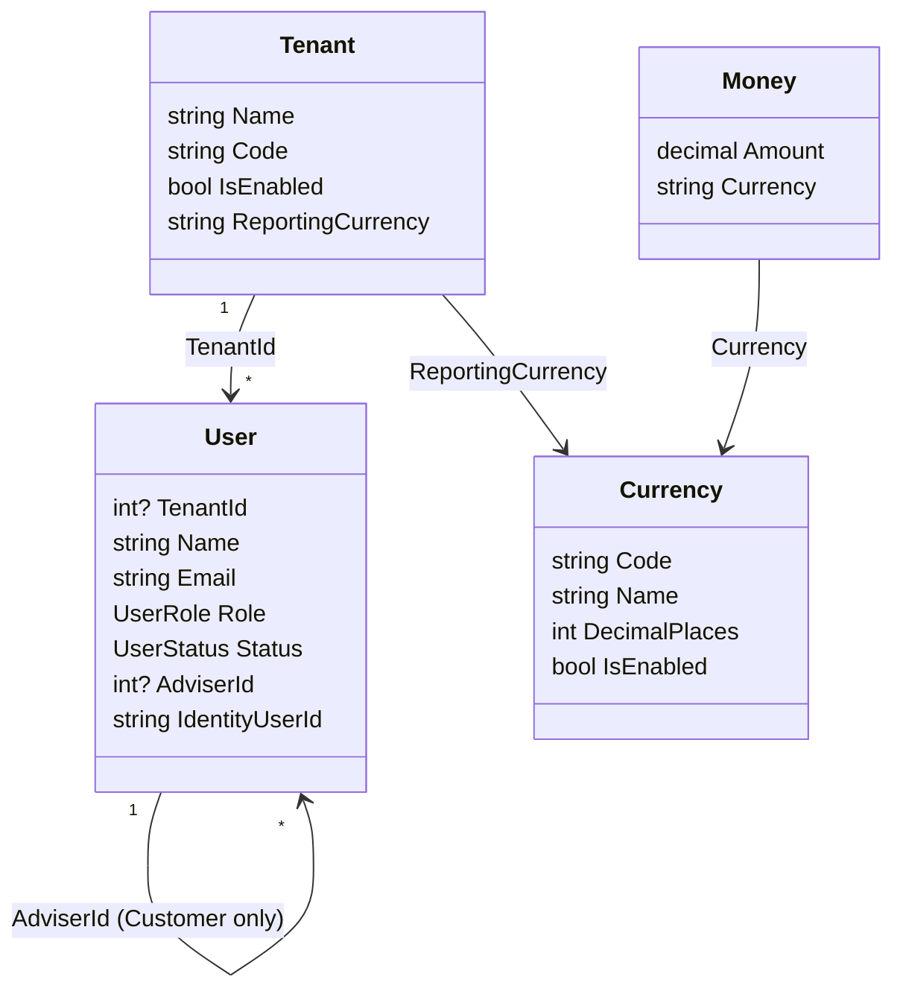

# Domain model

This document owns **aggregates, value objects, invariants, and domain events**. Scope and phasing live in the function plan. Tables live in database design. HTTP lives in API design.

**Product:** MyWealthV2.

Same rule as the function plan: if a later phase will use it and today’s model would have to change, write the final model now. If later use or shape is not decided, wait. Write now: a complete `UserStatus` machine whose invite transition has no Phase-1 entry; Customer as a login principal; `Money` with no balance column. Wait: a single `Transactions.Type` that pretends to be both cash and securities; ledger tables whose storage is still open.

The session protocol (OpenIddict, authorization code + PKCE, refresh) lives on the authorization server / in Infrastructure. It is **not** a domain aggregate. The domain only answers whether a person may be issued a session (tenant enabled, `UserStatus`, role, identity link).

---

## 1. Modelling rules

- Entities inherit `BaseEntity` (`int Id`) or `BaseAuditableEntity`. APIs expose `PublicId` (UUID). Internal keys do not appear in routes or JSON.
- Tenant-scoped business entities carry `TenantId`. Isolation is shared database + database FK + application dual check + EF filter + isolation tests. SystemAdmin has no tenant.
- A currency code must exist in the platform catalog and, when used as a **new** reference, be enabled. Access is through `ICurrencyCatalog`. The hot path does not JOIN.
- `Money` is a domain value object (amount + currency). Never persist a bare `decimal`. Phase 1 has no balance column; the type still lives in Domain so the ledger does not invent a second amount shape.
- Invariants live on entities / domain services, not only in FluentValidation.
- Identity stays in Infrastructure. Domain `User.IdentityUserId` points at the login principal. The link is one-way. There is no reverse domain association and no reverse database FK.
- Four roles share one Domain `Users` table and one `ApplicationUser` table. Role is immutable. A Customer is a login principal from day one. No Customer Portal client in Phase 1 does not mean no identity.
- The `UserStatus` machine is written once. Phase 1 create may set a password and land in `Active`. `PendingActivation` + `UserTokens` + `IEmailSender` are the invitation seams, not a half-boolean.
- OpenIddict clients, token stores, and the hosted login page are **not** Domain types.
- The Phase-2 ledger is thought as sub-ledgers (cash leg / security leg). §8 records the conceptual model and locked tendencies. It does **not** lock undecided storage (journal header, one vs two physical rows for a buy, Opening columns, close-and-liquidate, daily snapshots).

---

## 2. Phase 1 type diagram



- `Currency` is platform master data. It does not belong to a tenant.
- For SystemAdmin, `TenantId` and `AdviserId` are empty.
- `ApplicationUser` and OpenIddict stores sit outside this diagram.
- `UserToken` is an infrastructure seam (invite / reset hash). Phase 1 has no domain behaviour on it; it is not an aggregate on the diagram.

---

## 3. Aggregates and responsibilities (Phase 1)

| Type | Kind | Responsibility |
| --- | --- | --- |
| Tenant | Aggregate | Firm; login code; reporting currency; enabled flag |
| User | Aggregate | Person in any of the four roles; status machine; adviser assignment; link to Identity |
| Currency | Platform entity | ISO catalog; read through `ICurrencyCatalog` |
| Money | Value object | Amount + currency; equality is currency+amount; no cross-currency arithmetic |
| UserToken | Infrastructure entity | Reserved for invite / reset; no Phase-1 write use case and no domain methods |

Authorization (named policies, `RolePermissions`, handler scope checks) is not a domain object. The domain supplies Role / TenantId / AdviserId / Status for the application layer to apply.

---

## 4. Invariants (Phase 1)

### 4.1 Tenant

- `Tenant.Code` is globally unique, case-insensitive, and used at login. Character class `[a-z0-9-]`, length 2–50 (shape-compatible with a later subdomain label; Phase 1 does not parse Host).
- `Tenant.Name` is globally unique, CI.
- `ReportingCurrency` ∈ enabled rows in `Currencies`. Phase 1 may change reporting currency (no ledger balances keyed on it yet). If the ledger phase forbids the change, that spec tightens the rule. Do not invent immutability now and reverse it later.
- After `IsEnabled = false`, that Code must not complete login; existing refresh must fail. The check runs in the authorization server / resource pipeline against this invariant.
- A tenant may be re-enabled. Login with that Code works again only if the person’s `Status` is still `Active`.
- `RowVersion` conflict → HTTP 409.

### 4.2 Person

Role shape (CHECK-level, not a transition accident):

- SystemAdmin: `TenantId` empty, `AdviserId` empty. Email unique **globally**.
- TenantAdmin / Adviser: `TenantId` required, `AdviserId` empty.
- Customer: `TenantId` required, `AdviserId` required; target is same-tenant, Role=Adviser, not Disabled.
- All four roles have a login principal: `IdentityUserId` required, points at an existing Identity user, one-to-one.

Uniqueness and immutability:

- Email is unique inside a tenant (filtered unique where `TenantId IS NOT NULL`). Login resolves Domain `User` by `tenantCode + email`, then verifies the password.
- `Role`, `TenantId`, and `Email` cannot change. `Name` can.
- A Customer’s `AdviserId` may be reassigned to another non-disabled Adviser in the same tenant.

Status machine (written once):

```text
create ──password path──► Active
create ──no password / invite seam──► PendingActivation ──set password──► Active
Active ──disable──► Disabled
Disabled ──re-enable──► Active
PendingActivation ──disable──► Disabled
```

- Only `Active` may complete authorization-server login. `PendingActivation` and `Disabled` may not.
- Phase 1 admin APIs may create with a password and land in `Active` (invitation delivery is not built; that is not an excuse to collapse the machine to a boolean).
- Disable, re-enable, and password change run on the resource API. The authorization server reads Status and tenant enabled at login. Password change / disable / logout revoke that subject’s OpenIddict tokens — an application consequence driven by domain events. The User aggregate does not hold tokens.

Disable guards:

- Disable Adviser: reject while assigned Customers are not Disabled; reassign or disable them first.
- Disable Customer: Phase 1 has no accounts, so no ledger guard. When the ledger exists, the Accounts slice adds “reject if an Account is still open”. Do not create empty Account tables in Phase 1 to enforce that.
- Disabling the last TenantAdmin is allowed (known gap).
- Disabling a tenant does **not** bulk-update `User.Status`. Person status is independent; login checks both.

### 4.3 Currency

- Code is ISO 4217, three letters, upper case. `DecimalPlaces` follows the currency (JPY = 0, NZD = 2).
- A disabled currency cannot be used as a **new** `ReportingCurrency`. Tenants that already reference it keep the historical value.
- Phase 1 has no currency write API. The catalog is read-only. Seed: NZD, AUD, USD, EUR, GBP, JPY.

### 4.4 Session boundary (not an aggregate)

The domain does **not** contain: OIDC client, authorization code, refresh token, hosted login page.

The domain **does** supply the login gate:

- Non-SystemAdmin must resolve to an enabled Tenant by Code.
- The User for that email in that tenant must exist, `Status = Active`, and `IdentityUserId` must be valid.
- A Customer passing the gate does not receive adviser-management policies. A portal is an OIDC client plus a role gate, not a second kind of person.

---

## 5. Enumerations (Phase 1)

**UserRole:** `SystemAdmin`, `TenantAdmin`, `Adviser`, `Customer`  
**UserStatus:** `PendingActivation`, `Active`, `Disabled`

Do not add a fifth role in Phase 1. Ledger permission names are registered when the ledger domain opens. Do not hang empty policies in Phase 1.

---

## 6. Domain events (Phase 1)

Raise even if there is no subscriber yet. The application uses these events to revoke tokens and write audit.

| Event | When |
| --- | --- |
| `TenantCreated` | New firm |
| `TenantEnabled` / `TenantDisabled` | Enabled flag changes |
| `UserCreated` | After the dual write for any role |
| `UserActivated` | Entered Active (create-as-Active, invite activation, or re-enable from Disabled) |
| `UserDisabled` | Entered Disabled |
| `UserPasswordChanged` | Resource-API password change succeeded (revoke tokens for the subject) |
| `CustomerAdviserReassigned` | `Customer.AdviserId` changed |

Do not model OpenIddict token revocation itself as a domain event.

---

## 7. Explicitly out of the Phase 1 model

Do not create entities, tables, or empty aggregate roots for:

- Instrument, Account, Holding, CashEntry, Journal, Transaction
- Household / KYC / an invitation domain service (`UserTokens` table may exist with no behaviour)
- Account balances, holding quantities, net worth
- `IMarketData` / `IFxRate` (port surface not locked; introduce with Instruments)
- Refresh tokens, OIDC clients, authorization codes

The `Money` value object **does** live in the Domain assembly, even with no balance column in Phase 1.

---

## 8. Phase 2 ledger — conceptual model (tendencies; invariants when that phase opens)

The ledger is **one domain, several slices**, not an extension of a throwaway Phase-1 transaction table. Slice order (function plan): Instruments → Account container → cash sub-ledger → holdings / securities → posting and reversal → net-worth read model.

Session stack, four roles, and User / Tenant invariants do not change in Phase 2. Add ledger policy names and ledger invariants only.

### 8.1 Locked way of thinking

- **Cash and securities are two legs, not two values of one `Type` column.** A buy/sell has a cash leg and a security leg. Transfer / interest / dividend may be cash-only. Split / scrip is a security leg, cash 0, total cost unchanged. Do not ship a single-row catch-all `Transactions` table and split it later.
- **Do not create ledger tables while storage shape is still open.** No Journal header or standalone CashLedger table until that slice writes them.
- **Booked postings are not `UPDATE` / `DELETE`.** Correction tends to be a full opposite posting that points at the original (reversal).
- **After a posting, cash must not go negative on non-Credit accounts. Credit may be negative** (liability).
- **Day-to-day holding quantity and cost are not edited by hand.** The only entry that may write quantity and cost directly is Opening — lock the shape when that slice opens; keep the name.
- Instruments are a **tenant catalog**. Adviser may create; update / disable is TenantAdmin only. `QuoteCurrency` locks after create. Cost currency = quote currency.
- An Account is a value container under a Customer. `Account.Currency` is the cash-ledger booking currency and is immutable after open. Reserved types: Bank / Cash / Brokerage / Property / Credit / Other. Type does **not** replace the cash ledger: balance comes from cash postings, not from summing rows because `AccountType == Bank`.
- Credit counts as a liability in net worth. Closed accounts are excluded. Net worth returns per-currency arrays; no FX fold into one number.
- Market data and FX go through ports + mocks. Introduce `IMarketData` / `IFxRate` at the start of the ledger domain, with Instruments. Same currency = 1. Cross-currency is never silently 1.

### 8.2 Conceptual objects (not a table design)

```text
Tenant
  └── Customer (User)
        └── Account                    container: type, booking currency, status
              ├── Cash sub-ledger      cash legs and balance in that booking currency
              └── Holding              per instrument: quantity + CostBasis(Money)
                    └── Instrument     tenant catalog; quote currency

Posting
  points at Account
  may include a cash leg and/or a security leg
  original row is immutable; Reversal is a new posting that points at the original
```

Not decided — **do not turn these into entity fields now**:

- Whether a posting needs a journal header row
- Whether a buy/sell is one physical row or two
- Final Opening columns and whether negative quantity is allowed
- Whether close forces liquidation
- Whether a daily snapshot is stored

Lock those when the matching slice opens. Until then, do not paper over them with a temporary single table.

### 8.3 Join to Phase-1 people (said now so Phase 2 does not reshape User)

- An Account belongs to a Customer, and through that Customer to a Tenant. Adviser visibility stays the `AdviserId` scope. Do not add a second adviser FK on Account unless a slice proves it needs one.
- Disable Customer: reject if an Account is still open (guard added in Phase 2).
- A Customer who can obtain tokens does not receive `ledger.post`. Ledger write policies stay TenantAdmin / Adviser.

---

## 9. Value objects (Domain assembly; may exist in Phase 1)

| Object | Rules |
| --- | --- |
| `Money` | `Amount` (decimal) + `Currency` (three-letter code). Add/subtract only when currencies match. Cross-currency arithmetic must go through the FX port (no Phase-1 caller). |
| Currency code | Must resolve in `ICurrencyCatalog`. Entities store the code string, not an enum. |

The only Phase-1 field that uses a currency code is `Tenant.ReportingCurrency`.

---

## 10. Change log

| Date | Change |
| --- | --- |
| 2026-09-11 | First English draft, aligned with function-plan 2026-09-11: once-not-twice; session outside the domain; full UserStatus machine; Money defined early; ledger as sub-ledgers without locking undecided tables |
